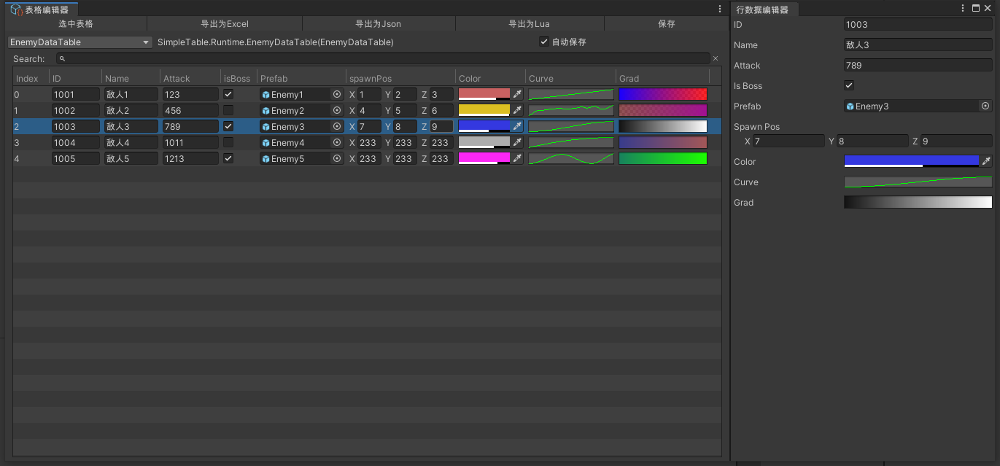
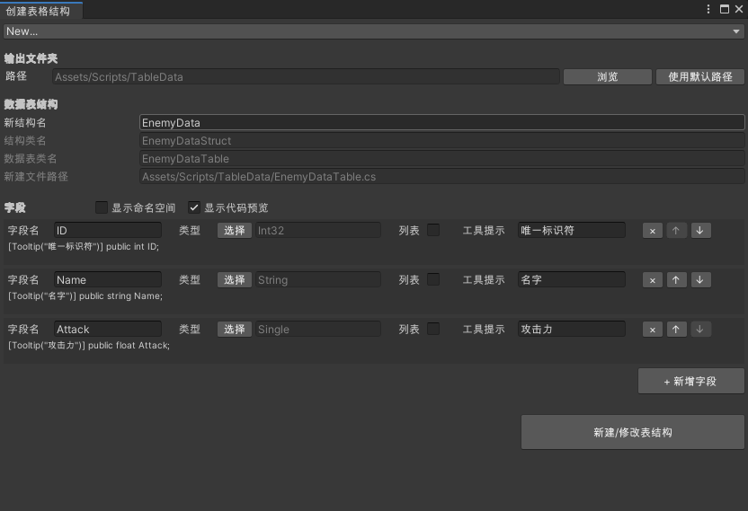
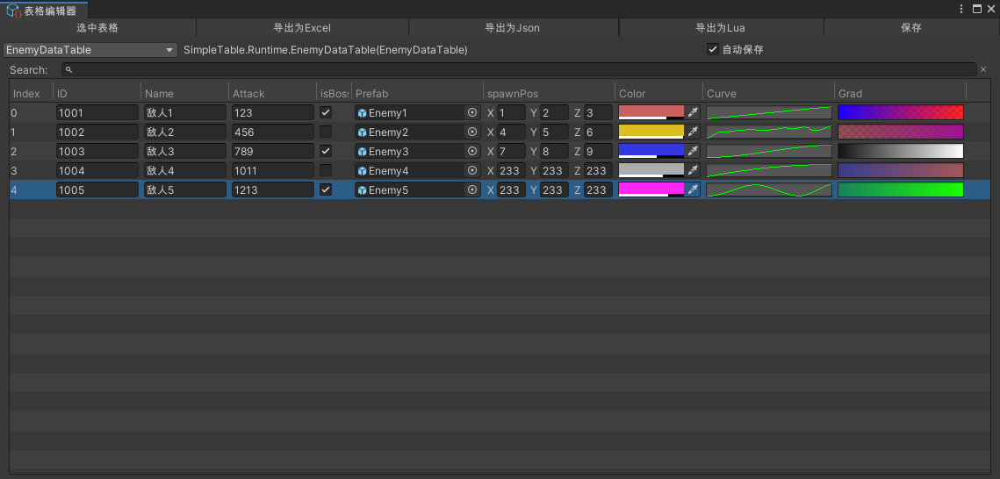
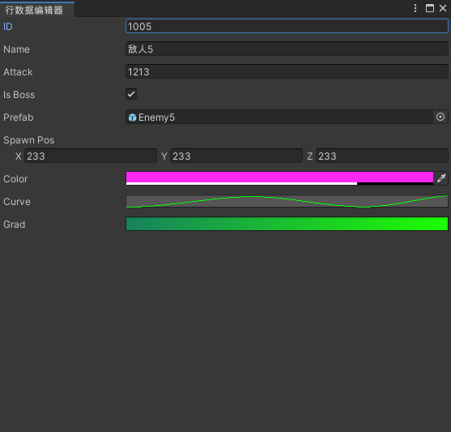
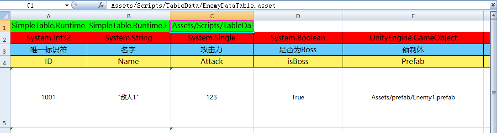
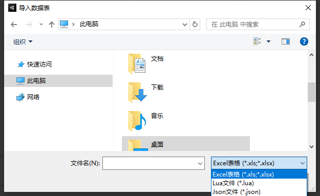

# SimpleTable

SimpleTable是基于ScriptableObject实现的一个简单的Unity数据表编辑工具,让开发者可以在Unity内高效直观地编辑表格,同时也提供导入和导出数据的功能



## TODO

目前还有一些未实现的功能,预计将在未来版本中实现

+ Lua的导入
+ Json的导出和导入
+ CSV的导出和导入
+ 表格编辑器更精确的搜索功能(目前的搜索会将一行的所有数据tostring后Contains,无法精确到某一列)

## 支持类型

+ string
+ int,long
+ float,double
+ bool
+ Vector2,Vector3,Vector4
+ Color,Color32
+ Rect
+ Bounds
+ Gradient
+ AnimationCurve
+ Sprite
+ Texture,Texture2D
+ AudioClip
+ AnimationClip
+ VideoClip
+ Material
+ Shader
+ 有 [Serializable] 特性的结构体
+ 修饰符为 public 的非嵌套枚举
+ List

## Unity版本

+ 2018.2及以上

## 依赖

+ [EPPlus](https://github.com/EPPlusSoftware/EPPlus) : 用于实现excel的导入和导出功能

## 安装

[下载unitypackage](https://github.com/MDLAJI/SimpleTable/releases)并导入

## 使用

### 1.创建表头

Tools -> SimpleTable -> 创建表格结构 , 点击打开窗口


上方下拉框选择`New...` , 选择路径, 输入结构名, 点击`+ 新增字段`创建字段,勾选`显示代码预览`后可以看到即将生成的代码. 添加完字段后点击`新建/修改表结构`即可生成脚本

### 2.修改表头

同上,点击上方下拉框后选择要修改的表头进行修改

### 3.创建数据表

在Assets中右键 -> Create -> 自定义 -> 数据表 -> 选择刚才创建的数据表类名即可创建数据表ScriptableObject

### 4.编辑数据表

双击数据表ScriptableObject即可打开表格编辑器.



+ **工具栏** : 编辑器最上方为工具栏,可以选中数据表资产,导出数据表以及手动保存;

+ **选择表格** : 工具栏下方的下拉选框可以选择切换工程内的数据表;

+ **保存** : 勾选`自动保存`后,在表格编辑器内的修改会立即应用到数据表SO上,如果取消勾选,则需要在编辑完成后点击上方的`保存`进行手动保存;

+ **搜索** : 在搜索框内输入字符串即可搜索,编辑器会显示符合搜索条件的行

+ **行操作** : 右键`增加行`可以新增一行数据,选中某一行后,右键可以进行上移或下移操作.


### 5.编辑行数据

对于大多数常用类型,可以直接在表格编辑器中编辑,而`List`和`Struct`等类型在表格编辑器中只会以Label的形式显示

双击某一行或右键选择`编辑行`即可打开行数据编辑器,行数据编辑器是一个浮动窗口,可以拖拽放置到合适的位置;当行数据编辑器窗口打开时,单击表格编辑器中的某行即可显示该行的数据



### 6.导出数据表

打开表格编辑器,点击工具栏的导出选项即可导出数据表

导出的文件会保存数据表的类名和资产路径以及表头信息,在编辑时不应该修改这部分的内容,否则可能导致导入错误



### 7.导入数据表
Tools -> SimpleTable -> 导入数据表 , 点击打开窗口

点击浏览后,点击右下方筛选文件类型并选择要导入的文件



点击导入,如果目标路径已存在数据表会自动覆盖,如果不存在则会自动创建

### 8.读取数据
获取数据表SO的引用后,通过`Data`属性获取数据

```csharp
public SimpleTable.Runtime.LevelDataTable DataTable;

// 获取总行数
Debug.Log($"Data Count : {DataTable.Data.Count}");

// 获取第0行的ID列数据
Debug.Log($"ID : {DataTable.Data[0].ID}");

// 获取List列的数据
foreach (var col in DataTable.Data[0].colorList)
    Debug.Log($"color: {col}");
```

## License

本项目的表格绘制部分代码修改自 [HTFramework](https://github.com/SaiTingHu/HTFramework) 的部分代码,原文件遵循 MIT 许可证.

本项目遵循 MIT 许可证.